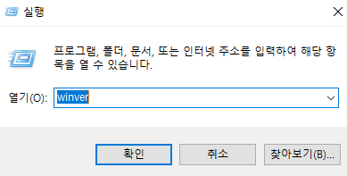
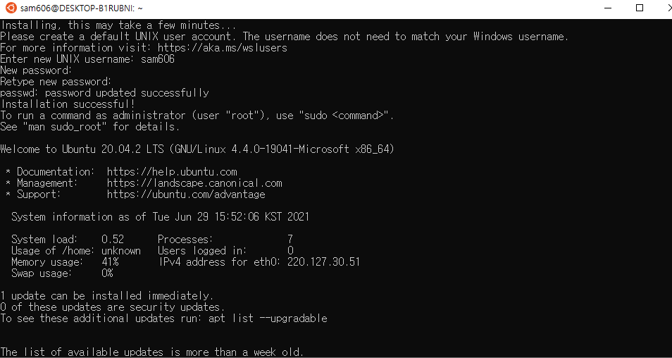

# [210702] 리눅스 - WSL2를 활용하여 리눅스 환경 구성하기

 MS에서 만든 `Windows`에서 보다 편하게 `Linux`를 사용할 수 있는 `WSL2`라는 기능을 제공한다. 오늘은 이 기능을 사용해보는 과정을 정리해보았다.

<br>

### 1. 윈도우 버전 확인

---

먼저, 해당 기능을 제공하는 적합한 버전의 윈도우가 PC에 설치 되어 있는지 확인해야한다.

`윈도우키 + R`을 누르면 실행창이 나타나게 된다.




<br>

위처럼 윈도우 버전을 확인 할 수 있는데 2004년 이상의 버전이여야한다.

위처럼 버전 `20`이면 2020년 이후 업데이트 버전이라는 뜻이므로 현재 상황에서는 문제없이 `WSL2`를 사용할 수 있다.

<br>

### 2. WSL 활성화

---

- `Windowss PowerShell`을 관리자 작업 실행으로 연다.
- 아래 코드를 입력해서 `WSL`를 활성화 시킨다.

```powershell
dism.exe /online /enable-feature /featurename:Microsoft-Windows-Subsystem-Linux /all /norestart
```


<br>

### 2-3. Ubuntu 설치

---

이제, Ubuntu를 설치해보자! 

https://aka.ms/wslstore <- 해당 링크로 가서 다운을 받고 설치를 한다. 


<br>

> [오류] 그리고, 설치된 `Ubuntu`를 실행을 하게되면, `WslRegisterDistribution failed with error: 0x8007019e` 에러가 발생할 수도 있음
>
> 
>
> <br>
>
> [해결 방법]
>
> - 해당 오류는 `Windows 기능`에 관한 오류라서, 기능을 껐다가 다시 키는 것으로 해결할 수 있다.
> - `실행`창에서 `optionalfeatures`를 입력하여 `Windows 기능 켜기/끄기`창을 연다.
>
> 
>
> <br>
>
> - 해당 창에서 `Linux용 Windows 하위 시스템`이 이미 체크가 되어 있으면, 체크를 해제하고 재시작 후 다시 체크를 한 후 재시작을 하게되면 `Ubuntu` 설치가 잘 작동된다.
> - 만약, 체크가 되어 있지 않으면, 체크를 하고 재시작후 `Ubuntu` 설치가 잘 작동되는 지 확인해보면 된다.
>
> 
>
> 


<br>

위의 오류가 해결되면, 아래처럼 `id`와 `password`를 입력하는 창이 나온다.

`id`는 소문자로만 이루어지도록 해야 오류가 나지 않는다.



<br>

### 4. 가상머신 플랫폼 활성화

---

아래 명령어를 `powershell`에 입력하여 WSL2를 위한 가상머신 플랫폼을 활성해줍니다.

```powershell
dism.exe /online /enable-feature /featurename:VirtualMachinePlatform /all /norestart
```

<br>

**WSL1 -> WSL2 변환**

`wsl -l -v`를 입력하여 현재 WSL 버전을 확인합니다. 현재는 , WSL 버전이 1일 것입니다. 이 떄문에 `WSL2`로 바꿔줘야합니다.


<br>

`wsl --set-version Ubuntu 2`를 입력하여 버전을 변경해줍니다.

```powershell
wsl --set-version Ubuntu 2
```


> [오류] - `WSL2 커널 구성 요소 업데이트가 필요합니다`라는 에러 발생
>
> 
>
> <br>
>
> [해결방법] - https://docs.microsoft.com/ko-kr/windows/wsl/install-win10#step-4---download-the-linux-kernel-update-package 에서 아래 파일을 다운받아서 설치해줍니다.
>
> 

<br>

> [오류] - 가상 컴퓨터 플랫폼 windows 기능을 사용하도록 설정하고 BIOS에서 가상화가 사용하도록 설정되어 있는지 확인하세요
>
> 
>
> [해결방법] - PC 다시시작 후 DEL키를 연타하여 BIOS에 진입하여 CPU탭에서 가상화 사용으로 설정해주면 됩니다.

<br>

### 5. WSL 확인

---

아래 명령어를 통해 wsl2 버전을 `default-version`으로 등록해줍니다.


<br>

`￦￦wsl$ `를 활용해서 Ubuntu가 잘 설치되어 있는지 확인합니다


